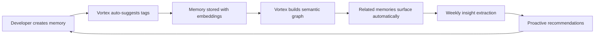

# 🧬 Aether Vortex — Context Intelligence Engine

<div align="center">

**The Brain Behind Persistent Developer Context**  
*Proprietary AI-Powered Intelligence Layer for the Aether Memory Platform*

[](https://devpost.com/software/lanonasis-aether-memory)
[](https://modelcontextprotocol.io)
[]()

</div>

---

## 🎯 What is Aether Vortex?

**Aether Vortex** is the proprietary **Context Intelligence Engine** that transforms raw developer memories into actionable, personalized intelligence. While traditional memory systems simply store and retrieve data, Vortex *understands* your context:

> 💡 **"Your AI coding assistant remembers what you worked on. Aether Vortex understands *why* it matters and *how* it connects to everything else."**

### The Intelligence Gap We Solve

```
❌ Traditional Memory Systems:
   Store → Retrieve → Done
   
✅ Aether Vortex:
   Store → Analyze → Connect → Learn → Predict → Evolve
         ↑                                        ↓
         └────── Continuous Intelligence Loop ────┘
```

---

## 🏆 Why This Matters for the ARM Hackathon

### The Innovation

Most AI coding assistants suffer from **context amnesia** — they forget everything between sessions. Even those with memory capabilities treat memories as flat data stores.

**Aether Vortex introduces a new paradigm: Persistent Personalized Context (PPC)**

| Capability | Standard Memory | Aether Vortex |
|-----------|----------------|---------------|
| **Storage** | ✅ Key-value pairs | ✅ Semantic embeddings |
| **Retrieval** | ✅ Keyword search | ✅ Vector similarity |
| **Intelligence** | ❌ None | ✅ Pattern recognition |
| **Personalization** | ❌ Generic | ✅ Learns your workflow |
| **Evolution** | ❌ Static | ✅ Self-optimizing |
| **Insights** | ❌ Manual | ✅ AI-extracted |

### Technical Differentiators

1. **Semantic Understanding** — Connects memories by *meaning*, not just tags
2. **Proactive Intelligence** — Surfaces insights before you ask for them  
3. **Health-Aware** — Self-monitors for knowledge gaps and inconsistencies
4. **Orchestrator-Ready** — Designed as a microservice for AI agent architectures

---

## 🧠 Core Intelligence Capabilities

### 1. Pattern Recognition Engine
Analyzes your development patterns over time to identify:
- Peak productivity windows
- Common context-switching patterns  
- Knowledge domain distribution
- Project lifecycle trends

### 2. Semantic Graph Builder
Creates an invisible knowledge graph that:
- Links related memories automatically
- Discovers hidden connections across projects
- Surfaces relevant context at the right moment

### 3. Insight Extraction Pipeline
AI-powered analysis that produces:
- Actionable learnings from your history
- Risk identification before issues occur
- Opportunity detection in your workflow
- Executive summaries of complex projects

### 4. Context Health Monitor
Continuously evaluates your knowledge base for:
- Missing semantic embeddings
- Inconsistent tagging patterns
- Knowledge silos and gaps
- Organization quality scores

---

## 🔧 Architecture: The Orchestrator Model

Aether Vortex is designed as a **specialized intelligence microservice** within the larger Aether Memory ecosystem:

```
┌─────────────────────────────────────────────────────────────────┐
│                    🎭 AI CODING ASSISTANT                        │
│                (Claude, Cursor, Windsurf, etc.)                 │
└───────────────────────────────┬─────────────────────────────────┘
                                │ MCP Protocol
                ┌───────────────┴───────────────┐
                ▼                               ▼
┌───────────────────────────┐   ┌───────────────────────────────────┐
│   📦 Aether Memory Core   │   │     🧬 AETHER VORTEX              │
│   (@lanonasis/mcp-core)   │   │   Context Intelligence Engine     │
│                           │   │                                   │
│   ✅ Memory CRUD          │◄──│   🔬 Pattern Analysis             │
│   ✅ Basic Search         │   │   🏷️  Intelligent Tagging         │
│   ✅ API Key Management   │   │   🔗 Semantic Connections         │
│   ✅ Auth & Sync          │──►│   💡 Insight Extraction           │
│                           │   │   🏥 Health Monitoring            │
└───────────────┬───────────┘   └───────────────┬───────────────────┘
                │                               │
                └───────────────┬───────────────┘
                                ▼
                    ┌───────────────────────┐
                    │  ☁️ Supabase + pgvector │
                    │   Unified Data Store   │
                    └───────────────────────┘
```

### Why Microservice Architecture?

- **Independent Scaling** — Intelligence layer scales separately from storage
- **Safe Iteration** — Evolve AI features without risking core functionality  
- **Composable** — Use with any MCP-compatible AI assistant
- **Portable** — Works beyond the Aether ecosystem

---

## ⚡ Quick Start

```bash
# Install dependencies
npm install

# Configure environment
cp .env.example .env
# Add your Supabase + OpenAI credentials

# Development mode
npm run dev

# Production
npm run build && npm start
```

### Environment Variables

```env
ONASIS_SUPABASE_URL=your_supabase_url
ONASIS_SUPABASE_SERVICE_KEY=your_service_key
OPENAI_API_KEY=your_openai_key
TRANSPORT=stdio  # or 'http' for remote access
PORT=3010        # HTTP port (default: 3010)
```

---

## 🔬 Intelligence Tools API

Aether Vortex exposes 6 specialized MCP tools that bring intelligence to any AI coding assistant:

### `vortex_analyze_patterns` 
**Behavioral Intelligence** — Learns your development patterns over time

```typescript
// Discover when you're most productive, what you focus on, and how your work evolves
{
  user_id: "uuid",
  time_range_days: 30,
  response_format: "markdown"
}
```

*Output: Productivity peaks, knowledge domain mapping, trend analysis with AI-generated insights*

---

### `vortex_suggest_tags`
**Semantic Classification** — AI understands your content and suggests consistent taxonomy

```typescript
// Never manually tag again - Vortex learns your vocabulary and applies it intelligently
{
  memory_id: "uuid",
  user_id: "uuid",
  max_suggestions: 5
}
```

*Output: Confidence-scored tags with reasoning, aligned to your existing taxonomy*

---

### `vortex_find_related`
**Knowledge Graph Traversal** — Discovers hidden connections in your memory vault

```typescript
// "Show me everything connected to this thought"
{
  memory_id: "uuid",
  user_id: "uuid",
  similarity_threshold: 0.7
}
```

*Output: Semantically related memories ranked by vector similarity, with shared context highlighted*

---

### `vortex_detect_duplicates`
**Memory Deduplication** — Keeps your knowledge base clean and efficient

```typescript
// Automatically identifies near-duplicate content for consolidation
{
  user_id: "uuid",
  similarity_threshold: 0.9,
  max_pairs: 20
}
```

*Output: Duplicate pairs with merge recommendations and storage optimization metrics*

---

### `vortex_extract_insights`
**AI-Powered Synthesis** — Transforms memories into actionable intelligence

```typescript
// "What have I learned about authentication patterns across all projects?"
{
  user_id: "uuid",
  topic: "authentication",
  max_memories: 20
}
```

*Output: Categorized insights (patterns, learnings, risks, opportunities), executive summary, supporting evidence*

---

### `vortex_health_check`
**Self-Monitoring** — Ensures your context stays healthy and organized

```typescript
// Proactive diagnostics for your knowledge base
{
  user_id: "uuid"
}
```

*Output: Health score (0-100), embedding coverage, tagging consistency, actionable recommendations*

---

## 🔌 IDE Integration

### Claude Desktop / Cursor / Windsurf

Add to your MCP configuration:

```json
{
  "mcpServers": {
    "aether-vortex": {
      "command": "node",
      "args": ["/path/to/aether-vortex/dist/index.js"],
      "env": {
        "ONASIS_SUPABASE_URL": "your_url",
        "ONASIS_SUPABASE_SERVICE_KEY": "your_key",
        "OPENAI_API_KEY": "your_key"
      }
    }
  }
}
```

### HTTP Mode (Remote/Cloud Deployment)

```bash
TRANSPORT=http PORT=3010 npm start
# Vortex now accessible at http://localhost:3010/mcp
```

---

## 📊 Real-World Intelligence Workflow



**Example Session:**

1. **You save**: *"Fixed auth bug by adding PKCE flow"*
2. **Vortex suggests**: `#authentication`, `#security`, `#oauth` (95% confidence)
3. **Vortex connects**: Links to 3 related memories from past OAuth work
4. **Vortex alerts**: *"You've fixed 4 auth issues this month - consider documenting your auth patterns"*
5. **Vortex recommends**: Creates an insight about your OAuth expertise

---

## 🏗️ Technical Specifications

| Spec | Value |
|------|-------|
| **Protocol** | MCP 1.0 (Model Context Protocol) |
| **Transport** | stdio / Streamable HTTP |
| **AI Model** | GPT-4o-mini (for cost-efficient analysis) |
| **Vector DB** | Supabase pgvector |
| **Embedding Dim** | 384 (all-MiniLM-L6-v2) / 1536 (OpenAI) |
| **Max Response** | 50,000 characters (auto-truncated) |
| **Rate Limits** | 500 memories per analysis batch |

### Database Requirements

```sql
-- Required schema
CREATE TABLE memory_entries (
  id UUID PRIMARY KEY,
  user_id UUID NOT NULL,
  title TEXT,
  content TEXT NOT NULL,
  type TEXT,
  tags TEXT[],
  embedding VECTOR(384),  -- or 1536 for OpenAI
  created_at TIMESTAMPTZ DEFAULT NOW()
);

-- Required RPC for vector search
CREATE FUNCTION match_memories(...)
RETURNS TABLE(...);
```

---

## 🛣️ Roadmap: The Intelligence Evolution

### Phase 1: Foundation ✅
- [x] Pattern recognition engine
- [x] Semantic tag suggestions  
- [x] Vector similarity search
- [x] Duplicate detection
- [x] Health monitoring

### Phase 2: Proactive Intelligence (Q1 2025)
- [ ] **Memory Clustering** — Auto-organize by topic
- [ ] **Summarization Pipeline** — TL;DR for memory collections
- [ ] **Anomaly Detection** — Flag unusual patterns

### Phase 3: Knowledge Fabric (Q2 2025)
- [ ] **Visual Knowledge Graph** — Interactive memory map
- [ ] **Cross-User Intelligence** — Team insights (privacy-preserving)
- [ ] **Predictive Context** — "You'll need this next"

### Phase 4: Autonomous Vortex (Q3 2025)
- [ ] **Self-Organizing Memory** — Zero-config intelligence
- [ ] **Multi-Modal Understanding** — Images, diagrams, voice
- [ ] **Local LLM Support** — Fully offline intelligence with Ollama

---

## 💡 Why Judges Should Care

### Technical Innovation
- **First MCP server** with dedicated intelligence layer for developer memory
- **Microservice architecture** that enables safe, independent AI evolution
- **Semantic-first** approach to developer context management

### Market Potential
- **Pain Point**: Developers lose 2+ hours/week searching for context
- **Unique Position**: Beyond storage — true understanding of developer workflow
- **Extensible**: Works with any MCP-compatible AI assistant

### ARM Synergy
- **Edge-Ready**: Designed for on-device deployment with local LLMs
- **Efficient**: Optimized for ARM's power-efficient processing
- **Offline-First**: Sync with cloud but never dependent on it

---

## 👥 The Vision

> *"We're not building another note-taking app. We're building the persistent memory layer that makes AI coding assistants truly personal."*

**Aether Vortex** is the missing piece between "AI that forgets" and "AI that understands you." By combining semantic intelligence, proactive insights, and self-organizing knowledge, we're creating the foundation for a new generation of developer tools.

---

<div align="center">

## 🏆 Built for the ARM AI Developer Challenge

**LanOnasis - Aether Memory Platform**

[](https://devpost.com/software/lanonasis-aether-memory)
[](https://github.com/lanonasis/aether-memory)

*Transforming raw memories into actionable developer intelligence.*

**MIT License** • Made with 🧠 by Derick @ LanOnasis

</div>
